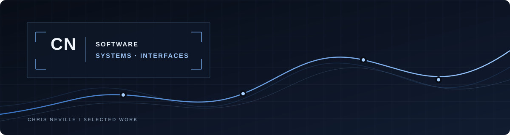

<h1 align="center">Chris Neville</h1>

  

<strong>Computer Science (Honours) Co-op · Carleton University · Ottawa, Canada</strong>

  
  
  
  

I build practical software for desktop workflows, local systems, networking, audio exploration, and geospatial tools.

### Featured Projects

**[Folder City](https://github.com/nevchr/Folder-City)** — A read-only Windows application that turns a local folder into an interactive 3D city for file-system exploration.

**[Sound Constellations](https://github.com/nevchr/Sound-Constellations)** — An offline audio explorer that maps local sample libraries by acoustic similarity, with waveform previews and 2D or 3D views.

**[PhotoTrace](https://github.com/nevchr/PhotoTrace)** — A desktop tool that matches photo timestamps to GPX tracks and creates geotagged copies without changing the originals.

**[SysDeck](https://github.com/nevchr/SysDeck)** — A Windows utility for system monitoring, indexed file search, storage analysis, duplicate detection, and file organization.

**[LAN Observer](https://github.com/nevchr/lan-observer)** — A local network dashboard for device discovery, status tracking, vendor details, and recognized devices.

**[Protocol: Eclipse](https://github.com/nevchr/Protocol-Eclipse)** — An interactive Python course project with resource management, decision-driven events, randomized encounters, and graph-based navigation.

### Technical Skills

**Languages:** Python · Java · TypeScript · JavaScript · HTML/CSS  
**Applications:** Electron · PySide6 · React · Flask · Three.js  
**Systems & tools:** SQLite · Docker · Linux · Windows · Git · GitHub

> [!NOTE]
> Open to Summer 2027 software, IT, and technical co-op opportunities.

  
  

